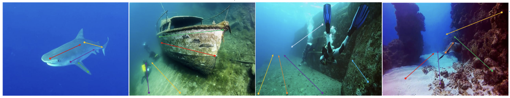
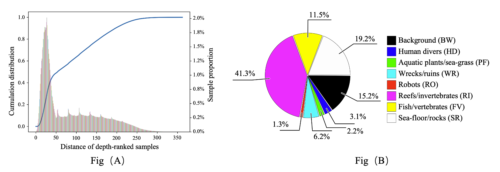

# SUIM-SDA: Underwater Imagery Benchmark with Sparse Depth Annotation
    
 

## Overview
  SUIM-SDA is extended from Segmentation of Underwater IMagery (SUIM) dataset by adding Sparse Depth Annota- tions (SDA), i.e., 
  depth trendlines and depth-ranked points.It features:
 
- **1596** images with sparse depth annotation 
- More than **6,000** depth trendlines
- **25 million** point pairs with relative depth labels
- All images have corresponding 8 categories of segmentation labels at the pixel level

The dataset has several components:

- Labeled: (a) Manually annotated sparse depth trendlines;  (b) Depth-Ranked Samples.
- Raw: The raw rgb and corresponding segmentation mask.
- Toolbox: Useful functions for manipulating the data and labels.

## Downloads
The data is available for download on [Google Drive](https://drive.google.com/file/********).  

On extraction, the downloaded file results in the following directory

        SUIM-SDA/
            Annotations/
                  trendlines/
                       1596 sparse depth trendlines files.
                  Ranked_sample/
                       1596 Depth-Ranked Samples files.
            Raw/
                1596 RGB images.
            Segmentation_mask/
                1596 ground-truth segmentation labels.

## Statistics of SUIM-SDA
 
 
 **Fig(A):** The distribution of the distance between pixels of the depth-ranked samples from the SUIM-SDA dataset. The histogram shows the percentage of samples that fall within the specified range. The curve shows the cumulative distribution.
 
 **Fig(B):** The percentage of semantic labels of the pixels which are used to make depth-ranked samples.
 
## Bibtex
If you find this dataset helpful, please cite the following works.

    @misc{w2023wsuid,
    title={Learning Scribbles for Dense Depth:Weakly-Supervised Single Underwater Image Depth Estimation Boosted by Multi-Task Learning},
    author={Kunqian Li and Xiya Wang and Wenjie Liu and Guojia Hou and Zhiguo Zhang and Kun Sun},
    journal={arXiv preprint arXiv:xxxx.xxxx},
    year={2023}
    }
